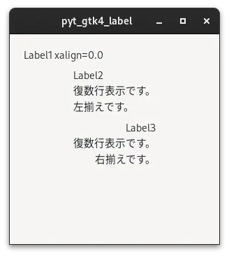
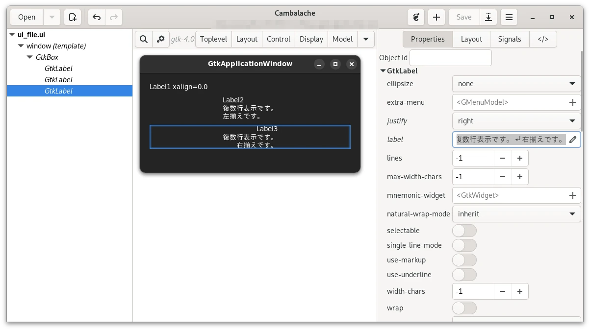

# 01_xalign

[戻る](../README.md)

<br>

## 内容 

- ラベルの文字の表示位置を調整する。(xalign)
- ラベルの文字を左揃えにする。(justify)
- ラベルの文字を右揃えにする。(justify)



<br>

### cambalacheで複数行のラベルを設定する。

cambalacheで対象のWidgdetのPropertiesを開いて、項目labelの入力欄横にある鉛筆アイコンをマウスでクリックして表示されるTextに入力する内容を記入する。Text欄では改行の入力も可能であり、それはLabelに反映されます。



```
          <object class="GtkLabel">
            <property name="label">Label2
復数行表示です。
左揃えです。</property>
          </object>
```

## 参考にしたHP

[戻る](../README.md)
