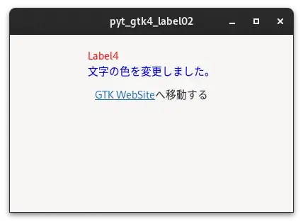

# 02_markup

[戻る](../README.md)

<br>

## 内容 

ラベルの文字を色付けする、Webページへのリンクを設定するプログラムです。  



<br>

ラベルの色を指定する

```
          <object class="GtkLabel">
            <property name="label">&lt;span foreground="red"&gt;Label4&lt;/span&gt;
&lt;span foreground="blue"&gt;文字の色を変更しました。&lt;/span&gt;</property>
            <property name="use-markup">True</property>
          </object>
```

<br>

ラベルにリンクを設定する

```
          <object class="GtkLabel">
            <property name="label">&lt;a href="https://www.gtk.org" title="GtkのWebサイトへ"&gt;GTK WebSite&lt;/a&gt;へ移動する</property>
            <property name="use-markup">True</property>
          </object>
```

<br>

## 参考にしたHP

[戻る](../README.md)
